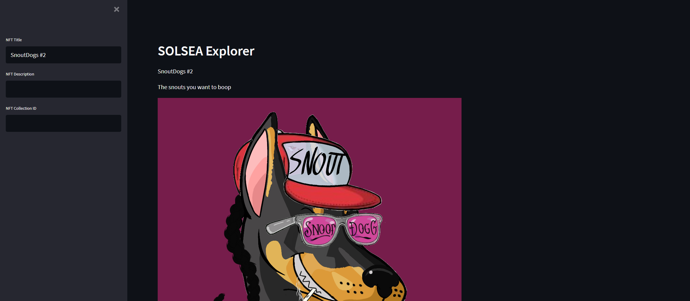

## SOLSEA NFT Explorer
Using Streamlit to build a simple UI on top of the Solana API.

https://share.streamlit.io/devincapriola/solsea-nft-explore/main/app.py
## Install 
```
git clone https://github.com/devincapriola/SOLSEA-NFT-EXPLORE.git
```

## Run
```
docker build -t app . 
```

```
docker run app
```

### Example


## 🤝 Contributing

Contributions, issues and feature requests are welcome!<br />Feel free to check [issues page](https://github.com/devincapriola/SOLSEA-NFT-EXPLORE/issues).

## Show your support
Give a ⭐️ if this project helped you!
